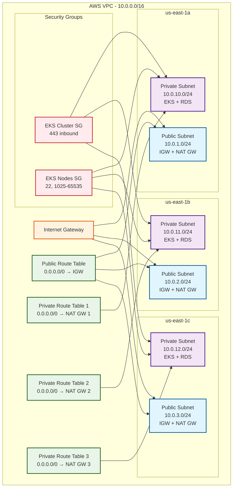

# VPC - Rede Virtual Privada

Este módulo provisiona uma VPC (Virtual Private Cloud) na AWS com subnets públicas e privadas, NAT Gateways, Internet Gateway e security groups otimizados para EKS.

## 📋 Visão Geral

A VPC é configurada com arquitetura de alta disponibilidade incluindo:
- **Subnets Públicas**: Para load balancers e recursos com acesso à internet
- **Subnets Privadas**: Para workloads sensíveis (EKS, RDS, etc.)
- **NAT Gateways**: Para permitir acesso à internet das subnets privadas
- **Security Groups**: Otimizados para cluster EKS
- **Multi-AZ**: Distribuição em múltiplas zonas de disponibilidade

## 🏗️ Arquitetura



## 🚀 Deploy

### Pré-requisitos

- AWS CLI configurado
- Terraform instalado
- Permissões adequadas na AWS (VPC, EC2, IAM)

### Deploy Automático (GitHub Actions)

O deploy é executado automaticamente via GitHub Actions quando há push para a branch `main`:

```yaml
# .github/workflows/deploy.yml
- Validação do Terraform
- Configuração do backend S3
- Geração do plano
- Aplicação das mudanças
- Verificação dos recursos criados
```

### Deploy Manual

```bash
# Deploy completo
make deploy

# Apenas gerar plano
make plan

# Verificar outputs
make output

# Destruir infraestrutura
make destroy
```

## ⚙️ Configuração

### Variáveis Principais

| Variável | Descrição | Padrão |
|----------|-----------|--------|
| `vpc_cidr` | CIDR da VPC | `10.0.0.0/16` |
| `availability_zones` | Zonas de disponibilidade | `["us-east-1a", "us-east-1b", "us-east-1c"]` |
| `public_subnet_cidrs` | CIDRs das subnets públicas | `["10.0.1.0/24", "10.0.2.0/24", "10.0.3.0/24"]` |
| `private_subnet_cidrs` | CIDRs das subnets privadas | `["10.0.10.0/24", "10.0.11.0/24", "10.0.12.0/24"]` |
| `aws_region` | Região AWS | `us-east-1` |
| `environment` | Ambiente | `production` |
| `project_name` | Nome do projeto | `fiap-hack` |

### Recursos Criados

| Recurso | Quantidade | Descrição |
|---------|------------|-----------|
| VPC | 1 | Rede virtual principal |
| Subnets Públicas | 3 | Uma por AZ |
| Subnets Privadas | 3 | Uma por AZ |
| Internet Gateway | 1 | Acesso à internet |
| NAT Gateways | 3 | Um por AZ |
| Route Tables | 4 | 1 pública + 3 privadas |
| Security Groups | 2 | EKS Cluster + EKS Nodes |

## 🔧 Comandos Úteis

### Makefile

```bash
# Ajuda
make help

# Deploy completo
make deploy

# Destruir infraestrutura
make destroy

# Gerar plano
make plan

# Ver outputs
make output

# Validar configuração
make validate

# Formatar código
make fmt

# Limpar arquivos temporários
make clean

# Configurar backend S3
make setup-backend
```

### AWS CLI

```bash
# Verificar VPC
aws ec2 describe-vpcs --vpc-ids $(cd terraform && terraform output -raw vpc_id)

# Listar subnets
aws ec2 describe-subnets --filters "Name=vpc-id,Values=$(cd terraform && terraform output -raw vpc_id)"

# Verificar NAT Gateways
aws ec2 describe-nat-gateways --filter "Name=vpc-id,Values=$(cd terraform && terraform output -raw vpc_id)"

# Verificar security groups
aws ec2 describe-security-groups --group-ids $(cd terraform && terraform output -raw cluster_security_group_id)
```

### Terraform

```bash
# Inicializar
cd terraform && terraform init

# Plan
cd terraform && terraform plan

# Apply
cd terraform && terraform apply

# Outputs
cd terraform && terraform output

# Destroy
cd terraform && terraform destroy
```

## 🔗 Conectividade

### Subnets Públicas

```bash
# CIDRs
10.0.1.0/24 (us-east-1a)
10.0.2.0/24 (us-east-1b)
10.0.3.0/24 (us-east-1c)

# Características
- Auto-assign public IP
- Rota para Internet Gateway
- Ideal para load balancers
```

### Subnets Privadas

```bash
# CIDRs
10.0.10.0/24 (us-east-1a)
10.0.11.0/24 (us-east-1b)
10.0.12.0/24 (us-east-1c)

# Características
- Sem auto-assign public IP
- Rota para NAT Gateway
- Ideal para EKS, RDS, etc.
```

## 🔒 Segurança

### Security Groups

#### EKS Cluster Security Group
```bash
# Inbound
- Porta 443 (HTTPS) de 0.0.0.0/0

# Outbound
- Todas as portas para 0.0.0.0/0
```

#### EKS Nodes Security Group
```bash
# Inbound
- Porta 22 (SSH) de 10.0.0.0/16
- Portas 1025-65535 de 10.0.0.0/16

# Outbound
- Todas as portas para 0.0.0.0/0
```

### Network ACLs

Por padrão, as Network ACLs padrão da AWS são usadas:
- Permitir todo tráfego inbound/outbound
- Para restrições adicionais, configure ACLs customizadas

## 📊 Monitoramento

### CloudWatch

```bash
# Métricas disponíveis
- NATGatewayBytesIn
- NATGatewayBytesOut
- NATGatewayActiveConnectionCount
- NATGatewayConnectionCount
```

### VPC Flow Logs

Para habilitar VPC Flow Logs:

```bash
# Criar IAM role para VPC Flow Logs
aws iam create-role --role-name VPCFlowLogRole --assume-role-policy-document file://trust-policy.json

# Habilitar flow logs
aws ec2 create-flow-logs --resource-type VPC --resource-ids $(cd terraform && terraform output -raw vpc_id) --traffic-type ALL --log-destination-type cloud-watch-logs --log-group-name VPCFlowLogs
```

## 🔄 Atualizações

### Adicionar Subnets

```bash
# 1. Atualizar variáveis
variable "public_subnet_cidrs" {
  default = ["10.0.1.0/24", "10.0.2.0/24", "10.0.3.0/24", "10.0.4.0/24"]
}

# 2. Aplicar mudanças
cd terraform && terraform plan
cd terraform && terraform apply
```

### Modificar CIDRs

⚠️ **Atenção**: Modificar CIDRs pode causar downtime. Considere criar nova VPC.

## 🚨 Troubleshooting

### Problemas Comuns

1. **NAT Gateway não funciona**
   ```bash
   # Verificar EIP
   aws ec2 describe-addresses --allocation-ids $(aws ec2 describe-nat-gateways --query 'NatGateways[0].NatGatewayAddresses[0].AllocationId' --output text)
   
   # Verificar route table
   aws ec2 describe-route-tables --route-table-ids $(cd terraform && terraform output -raw private_route_table_ids)
   ```

2. **Subnet não acessível**
   ```bash
   # Verificar route table associations
   aws ec2 describe-route-tables --filters "Name=vpc-id,Values=$(cd terraform && terraform output -raw vpc_id)"
   ```

3. **Security Group bloqueando tráfego**
   ```bash
   # Verificar regras
   aws ec2 describe-security-groups --group-ids $(cd terraform && terraform output -raw cluster_security_group_id)
   ```

### Logs

```bash
# VPC Flow Logs (se habilitado)
aws logs describe-log-groups --log-group-name-prefix VPCFlowLogs

# CloudTrail (para auditoria)
aws cloudtrail lookup-events --lookup-attributes AttributeKey=ResourceName,AttributeValue=$(cd terraform && terraform output -raw vpc_id)
```